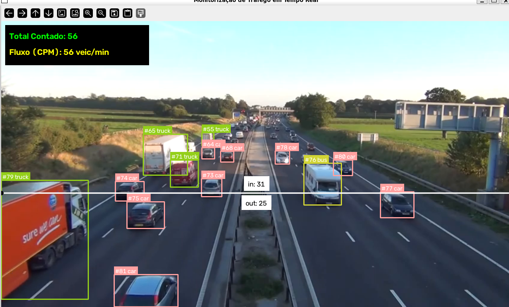

# VisionTraffic — Monitorização e Contagem de Tráfego em Tempo Real

O **VisionTraffic** é um sistema de Visão Computacional desenvolvido em Python para deteção, rastreamento e análise de fluxo de veículos em autoestradas e vias urbanas. Utilizando o modelo **YOLOv8** acoplado a algoritmos de rastreamento (*tracking*) e análise espacial, a aplicação calcula o total de veículos contados e a métrica dinâmica de **Carros por Minuto (CPM)**.

---

## Demonstração

<!-- Substitua o caminho abaixo pela imagem ou GIF da sua aplicação rodando -->


> *Nota: O sistema atribui um ID único e persistente a cada veículo e valida a contagem ao cruzar a linha virtual.*

---

##  Funcionalidades

- **Deteção Multiclasse de Veículos:** Identifica automóveis, motociclos, autocarros e camiões.
- **Rastreamento Contínuo (Tracking):** Atribui identificadores únicos (`tracker_id`) para evitar contagens duplicadas.
- **Linha Virtual de Cruzamento:** Conta veículos no momento exato em que atravessam a região de interesse.
- **Fluxo em Tempo Real (CPM):** Calcula a taxa de Carros por Minuto através de uma janela temporal deslizante de 60 segundos.
- **Arquitetura Modular:** Código separado em módulos reutilizáveis de captura, deteção e análise.

---

##  Tecnologias Utilizadas

- **Linguagem:** Python 3.10+
- **Visão Computacional & Redes Neurais:** [Ultralytics YOLOv8](https://docs.ultralytics.com/) (`yolov8m.pt`)
- **Processamento de Imagem:** [OpenCV](https://opencv.org/)
- **Análise Espacial & Anotação:** [Supervision](https://supervision.roboflow.com/)
- **Estruturas de Dados:** NumPy & Collections (`deque`)

---

##  Estrutura do Projeto

```text
visiontraffic/
├── data/
│   └── .gitkeep            # Pasta para guardar os vídeos de teste (ex: transito.mp4)
├── models/                 # Repositório dos pesos do modelo YOLO (yolov8m.pt)
├── src/
│   ├── __init__.py
│   ├── capture.py          # Gestão do fluxo de vídeo e redimensionamento
│   ├── detector.py         # Inferência YOLO e atribuição de IDs
│   └── analytics.py        # Linha virtual de contagem e cálculo de CPM
├── .gitignore              # Filtro para ignorar ficheiros pesados e venv
├── requirements.txt        # Dependências do projeto
├── README.md               # Documentação do projeto
└── main.py                 # Ponto de entrada da aplicação
